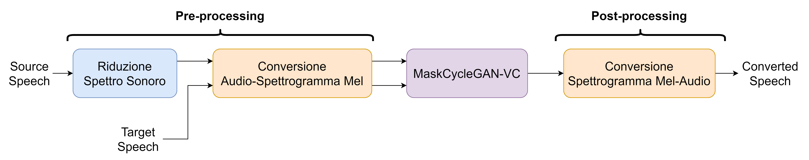
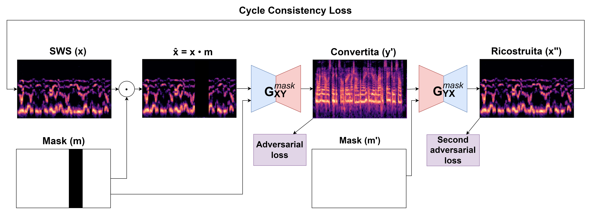

# Un Approccio alla Voice Conversion a Spettro Ridotto attraverso la Sine-Wave Speech

# Overview
This work presents a **novel approach** to the problem of voice conversion (VC) in the reduced spectrum domain. The proposed methods are based on the **Sine-Wave Speech** (SWS) technique and the **Vocoded Speech**.

The idea behind this work is to use some classical audio processing techniques in order to achive **dimensionality reduction** of the speech signal.

As a result, the proposed methods **are able** to convert the voice of a speaker into the voice of another speaker, while **preserving the linguistic content** of the original speech signal.

The architecture of the proposed methods is based on the **MaskCycleGAN** model by [Kaneko et al.](https://arxiv.org/abs/2102.12841).

# More details
In order to get more details about the proposed methods, please refer to the [thesis](tesi.pdf) or to the [slides](slides/tesi-slides.pdf).
Actually, the thesis is written in Italian, but I'm working on the English translation.